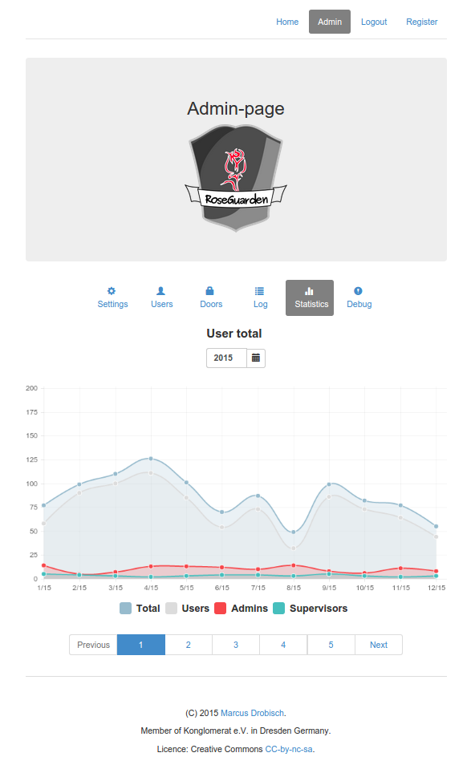
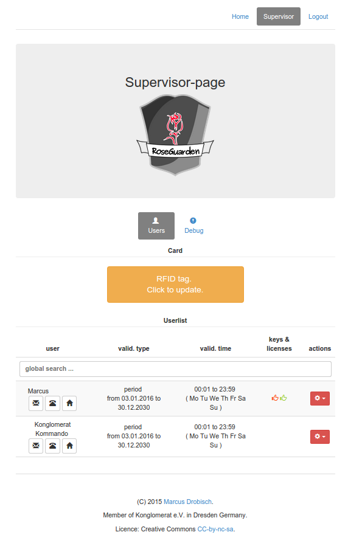

RoseGuarden
===========

A remote door api and web application for Raspberry Pi, Odroid, Orange Pi or BeagleBoard (based on python).

Features
========

* affordable access-control system
* authentication by rfid-tags or webserver-application (smarthone, tablet)
* easily extendable for additional doors. through network based system
* 3 different user-roles (user, supervisor, admin) for managing accesses and viewing logs
* different types of accesses (period, days-budget)
* additional options to adjust accesses (by given time, weekdays, differenet door-licences)
* basic statistics (total users, total accesses, accesses per weekday, accesses per door/node)


Roadmap
=======

Roseguarden is in development. Till now there exist only a prerelease version. The following steps are planed till release and further. While there is only one contributor to the project by now, don't expect any release dates. It's done when it's done.

* Build up and run a community forum [Finished 2017-01-17 [Community forum](http://www.community.fabba.space/)].
* Integrate the http-server into flask [In development].
* Implement a web-gui setup to replace the config.ini. [planned]
* Package Roseguarden into images (ISO) for Raspberry Pi 2, 3 and Zero. [planned]
* Provide a user manual for important task and usage of Roseguarden [planned]
* __**Release version 1.0.0 images**__ [planned]
* Integrate a tool to repair broken rfid-tags [planned]
* Build a web-gui export and import feature for user-backup [planned]
* Build in user groups for easy handling of multiple users [planned]
* __**Release Version 1.1.0**__ [planned]

Backlog for further release:
---------------------------

* OLED display support
* Replace SPI-Py package with a more stable module
* Rework RFID-module
* support for machine-control (enable/license machines)
* support a cashless payment system


News & Community
================

The project has a community forum. News will be posted there. In addition its purpose is to find help, discuss features or report bugs. You are welcome to contribute to the project there.

[To the community forum](http://www.community.fabba.space/)


Overview
========


Quickstart
==========


Install RoseGuarden
-------------------

Clone the repository to your installation path with `git clone https://github.com/blinzelaffe/roseguarden.git`

Install dependencies
--------------------

First of all update and upgrade your raspberry pi os

1. `sudo apt-get update`
2. `sudo apt-get upgrade`

For the frontend we need nodejs to get a module called bower and a fast nodejs http-server.
The http-server serve the http-request. Bower will handle all the frontend dependencies.
You can install the most actual nodejs package like this.

3. `wget http://node-arm.herokuapp.com/node_0.10.36_armhf.deb`
4. `sudo dpkg -i node_0.10.36_armhf.deb`

NOTE: for the old raspberry pi the nodejs 0.10.36 is used. Some newer versions have problems with the c++ libaries.
Have a look at http://weworkweplay.com/play/raspberry-pi-nodejs/ for further informations and instructions.
The newest nodejs-version 4.2.1 suppose to have direct raspberry pi (ARM6/ARM7) support included.
It has to be tested with RoseGuarden.

Alternative way to install LTS version of nodejs (4.2.4) for raspberry pi

for raspberry pi A,B,B+ :
wget https://nodejs.org/dist/v4.2.4/node-v4.2.4-linux-armv6l.tar.xz
tar -xvf node-v4.2.4-linux-armv6l.tar.xz
cd node-v4.2.4-linux-armv6l
sudo cp -R {bin,include,lib,share} /usr/local/


or for raspberry pi 2:
wget https://nodejs.org/dist/v4.2.4/node-v4.2.4-linux-armv7l.tar.xz
tar -xvf node-v4.2.4-linux-armv7l.tar.xz
cd node-v4.2.4-linux-armv7l
sudo cp -R {bin,include,lib,share} /usr/local/

First we install the nodejs-http-server
For this step you have to switch to the `client`-directory and prompt

5. `sudo npm install -g http-server`

Now we could install bower and let bower get us the packages for the frontend (css, angularjs, smarttable, etc.).
In the same `client`-directory prompt

6. `sudo npm install -g bower`
7. install the bower packages with `bower install` (in the `client`-directory install)

Now the frontend is ready.

For the backend (python) we have to install dependecies, too.

First we install `python-dev` and `gcc` on the raspberry to establish interfaces between c++-libs and python.

8. `sudo apt-get install python-dev` needed to compile c++-bindings with python
9. `sudo apt-get install gcc libjpeg-dev zlib1g-dev` needed to compile c++, jpge and zlib

The python package manager `pip` will handle needed python modules for us. So we need to install `pip` like this.

10. `sudo apt-get install python-pip`

At this point we will get the python packages list in the `requirement.txt` file.
Switch to the `server`-directory and prompt.

11. `sudo pip install -r requirements.txt` (in the `server`-directory)

To use the rfid-reader (rc522) we have to install SPI-Py. Switch to the `server/app/SPI-Py`-directory and
install the dependencies and the module.

10. `sudo python setup.py install` install the module

Note: depending on your raspberry pi and kernel you have to re/enable the spi-module and the device tree support
with `sudo raspi-config` -> 'Advanded Options'

Initial steps
-------------

- copy the template `config.template.ini` in the `server` - directory to `config.ini` with `cp config.template.ini config.ini`
- change settings to your requirements
- initialize RoseGuarden database in the `server` - directory with `sudo python roseGuarden.py create_db`


Running RoseGuarden
-------------------

- start the http-server in the `client` - directory with  `http-server -p 8000`
- start the RoseGuarden-app in the `server` - directory with `sudo python roseGuarden.py start`

Use RoseGuarden
----------------

- after complete installation and setup you can reach the admin panel on the ip of your raspberry pi (port 8000)
- e.g. enter "192.168.1.100:8000" in your browser (Chrome or Mozilla are suggested)

- The initial administrator-account is: Administrator
- The initial administrator-password is: pleasechangethepassword
- please change the password after your first login

Problems durring installation and running RoseGuarden
-----------------------------------------------------

** _Problem:_ **

Modules (e.g. Flask) could not found while running `sudo python roseGuarden.py create_db` or `sudo python roseGuarden.py start`

** _Solution:_ **

- Go to `/your-roseguarden-directory/server/`
- repeat the installation of the python modules with `sudo pip install -r requirements.txt`
- sometime there are problems with a bad internet connection, check this twice before running the installation (e.g. ping to a known web-site)

** _Other Hints:_ **

Some other known issues regarding the WLan and the RFID-Reader can be found at the end of the page.

Have a look at the known issues on Github ( https://github.com/blinzelaffe/roseguarden/issues?utf8=%E2%9C%93&q=is%3Aissue+ ) and see problems already known.

Sometimes a update will help to get the latest version of RoseGuarden and some fixed bugs. See the section below for this.


Update RoseGuarden
------------------

For updating RoseGuarden stop its running process.

To update the software to the latest version on github, use git.

- `git fetch --all`
- `git reset --hard origin/master`

Now switch to the `server`-directory:

If some new external pip-modules are introduces in a version you need to reload the `requirements.txt`.

- `sudo pip install -r requirements.txt`


In addition a upgrade of the migration from the database is required, use roseGuarden.py.

- `sudo python roseGuarden.py db upgrade`

For migrations or upgrades of the database, new data have to been seeded (storing default values). So please run,

- `sudo python roseGuarden.py seed`


To update the client switch to your client directory e.g the `client`-directory:

Here we have to install/uninstall all new/old packages of bower.

- `bower install` (no `sudo` required)

After updating please restart your roseGuarden-application again.
It should be work after this with the newest version for server and client.

Install autostart and montoring (supervisor)
============================================

After testing roseGuarden on the system you can add a autostart and monitoring of the application and the http-server.
We use supervisor for this purpose.

You can install supersior from distribution package

- `sudo apt-get install supervisor`

- `sudo service supervisor restart`

The config of supervisord is stored on your system in the following file: `/etc/supervisor/supervisord.conf`.
There is a template in the repository `documentation/templates&scripts/supervisord.config`.
Use the file to adapt it to your system (especially the pathes).

Screenshots (Software)
======================






Hardware
========

The hardware consists of the following electronics  types mounted on a board.

- the control unit (Rapsberry Pi, Orange Pi, Beagleboard or Odroid): running the Python based app and server.
- a RFID-reader (e.g. RC552): reading and writing the tags
- a relay-module: controling the door-openers
- a dc-dc-converter: supplying the control unit with a input  of e.g. 12V / 24V and a output of 5V
- a micro-usb cable of 30cm length: connect dc-dc-converter to the control unit
- some internal cable: e.g. from dc-dc converter to the relay module or to the raspberry pi

Screenshots (Hardware)
----------------------

Here some photos of the assembled and mounted Roseguarden device in the early stage.

 

 


Recommended bill of material
----------------------------

We recommend the following tested devices:

- Rapsberry Pi 1 B (found on watterot, rs online, digikey)
- KIS3R33S dc-dc converter (found on ebay from various distributoirs from about 3€ per piece)
- RC552 rfid reader, including 2 rfid-tags (found on ebay from various distributors from about 3€ per piece)
- SainSmart 2 ch. relay module or compatible (found on ebay from various distributors and producers from about 3€ per piece)
- the 3d-printed case on below
- 4 x M2 and 10 x M3 screws to mount the electronic to the case

additional for connecting and supllying the device:

- some breadboard female-female connector (found on pollin, watterot or sparkun)
- some cable with at least 3 wires @ 1A (found on pollin, reichelt, digikey or your local electronic store)
- a ethernet-patch-cable (found on pollin, reichelt, digikey or your laocal electronic store)
- or a wifi-dongle (found on pollin, reichelt, digikey or your laocal electronic store)

additional for mounting the device on walls or doors:

- suckers with 40mm diameter and M4-bolts (found on ebay from various distributors from about 7€ per 10 pieces)
- or glue tape for mounting
- or screws for mounting 

Case and Mounting
-----------------

The case ist modeled with the powerful open source software FreeCAD. Have a look in the hardware folder for the current stable version of the board and its case. It is designed to be 3d-printed with dimensions of 145mm x 145mm x 60mm. The design uses suckers to mount the device to windows or doors. With a few modifications you can also use screws for a more stable mounting. Be aware that the RFID-communication could only reach throw about 30mm non-metallic walls or glass (+ aboout 20mm rfid-module-to-wall distance). 

 

Feel free to change the design to your needs. Please share your changed designs and new versions with the community (by asking for a push request). 


Assembly
--------

To assemble the components, you only need some additional M2 and M3 screws to put the electronics on the board. While using other electronics than recommended, change the board modell to your needs. The positions are marked for easy assembly. The cable can put throw cable holes and routed along dedicated bolts.

The schematic show the connection between raspberry pi and the modules.


Further Documentation
=====================

Further documentation and information on components and installation could be found on the project-wiki http://h2371910.stratoserver.net/projects/tuer-und-geraeteverwaltung-rosenguarden/wiki/Wiki (german language only, please translate via google translate or other services).

Troubleshooting
===============

*The WLAN connection breaks ofter some time*

Normally the wlan connection timed out after a while.
The default config of raspberry pi (wheezy) don't reconnect to disappearing networks.
To fix this the following steps could enable the reconnection.

- change to /etc/ifplugd/action.d/ with `cd /etc/ifplugd/action.d/`
- copy the ifupdown file to ifupdown.original (for backup) with: `sudo cp ifupdown ifupdown.original`
- overwrite ifupdown with the alternative ifupdown from the wpa_supplicant-folder with:  `sudo cp /etc/wpa_supplicant/ifupdown.sh ./ifupdown`
- reboot with `sudo reboot`

Alternativly you can tools like wicd-curses.
Instructions for wicd-curses can be found in the internet.

*I have problems to develop under windows*

- Install the python Visual C++-Compiler from  http://aka.ms/vcpython27 before installing the requirements
- user requirements_win_dev.txt instead of requirements.txt (SPI-Py is for linux only)

*The rfid don't read any tag*

With Kernel 3.18 and above Rasbian switch to device tree support on default.
A detailed description is shown here: https://www.raspberrypi.org/forums/viewtopic.php?t=97314
This could encounter problems with the spi.

To fix the issue you have to re/enable the spi-module.
To setup this use `sudo raspi-config` -> 'Advanded Options' or write the changes directly to `/boot/config.txt`
on your own.

For Raspbbery Pi B

`dtparam=spi=on`

`dtoverlay=spi-bcm2708`

have to been set.

For Raspberry Pi 2 (not tested, yet)

`dtparam=spi=on`

`dtoverlay=spi-bcm2835`

should be working (not tested yet)

For Raspberry Pi 2 please consider, there is be a another pin-out-connectio needed. Some instructions described here:
https://www.raspberrypi.org/forums/viewtopic.php?f=37&t=106313 or a alternative way to enable SPI here http://bsd.ee/~hadara/blog/?p=1017


Mifare_RC522_RFID Raspberry Pi 2 B

MOSI ——————————> pin 19 e.g. GPIO 10

MISO ——————————> pin 21 e.g. GPIO 9

SCLK ——————————> pin 23 e.g. GPIO 11

SDA  ——————————> pin 24 e.g. GPIO 8

RST  ——————————> pin 22 e.g. GPIO 25

IRQ  ——————————> NONE

In addition you have to change your SPI-Py library. There is a bug, which isn't fixed and break the communication to the Mifare-Module.

change the following code in the `/server/app/SPI-Py/spi.c`-file.

```c
	struct spi_ioc_transfer tr = {
		.tx_buf = (unsigned long)tx,
		.rx_buf = (unsigned long)rx,
		.len = tupleSize,
		.delay_usecs = delay,
		.speed_hz = speed,
		.bits_per_word = bits,
        .cs_change = 1,
    };
```

to

```c
	struct spi_ioc_transfer tr = {
		.tx_buf = (unsigned long)tx,
		.rx_buf = (unsigned long)rx,
		.len = tupleSize,
		.delay_usecs = delay,
		.speed_hz = speed,
		.bits_per_word = bits,
        .cs_change = 0,
	};
```

License
=======

RoseGuarden is published under the terms of the GPL v3 license. See [LICENSE](LICENSE).
